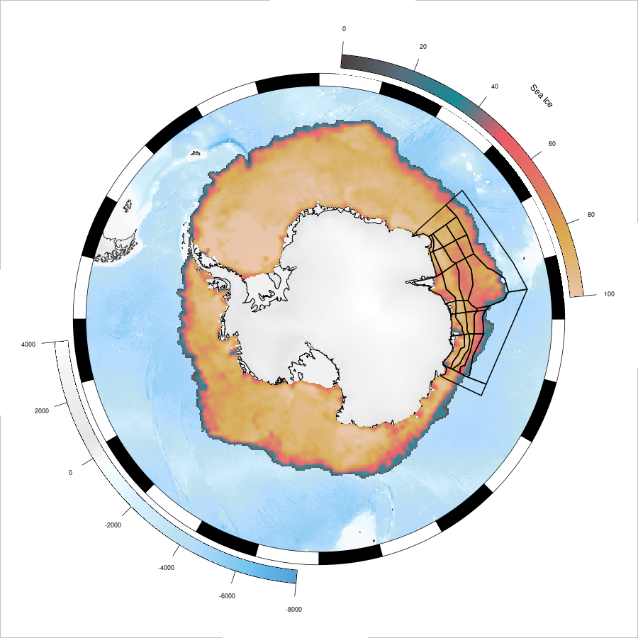

# East Antarctic Atlantis Ecosystem Model



## Description

The East Antarctic Atlantis Ecosystem Model is a comprehensive simulation model that represents the ecosystem dynamics of the East Antarctic region. This model incorporates various environmental factors, biological interactions, and human uses to simulate the functioning and sustainability of the East Antarctic ecosystem.

## Features

- Simulates the interactions between key components of the East Antarctic ecosystem, including marine life, land-based organisms, and climate factors.
- Provides insights into the population dynamics, food web relationships, and species distributions within the East Antarctic ecosystem.
- Enables the exploration of different scenarios and the assessment of potential impacts on the ecosystem due to climate change, fishing activities, or other human interventions.

## Installation

1. Clone the repository:

   ```shell
   git clone https://github.com/East-Antarctic-Atlantis-model/EA_model.git
   ```

2. Install the required dependencies:

   ```shell
    Check Atlantis confluence page
   ```

3. Download the necessary input data:
  All the data needed to run the model is contained in this repository

## Contributing

Contributions to the Antarctic Atlantis Ecosystem Model are welcome! If you have ideas for improvements, new features, or bug fixes, please submit a pull request. Ensure that your code adheres to the project's coding style and guidelines.

## License

Not sure what Licence here

## Acknowledgments

We would like to express our gratitude to the following organizations and researchers for their contributions to the understanding of the East Antarctic ecosystem:

- Australian Antarctic division (AAD)
- Institute for Marine and Antarctic Studies (IMAS)
- Commonwealth Scientific and Industrial Research Organisation (CSIRO)

## Contact

For any questions or inquiries, please use github.
